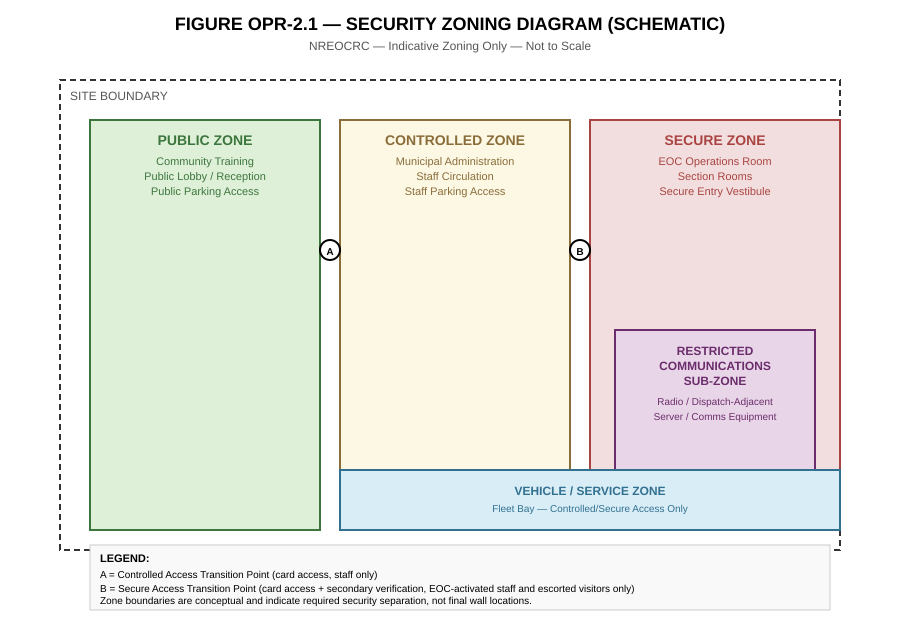
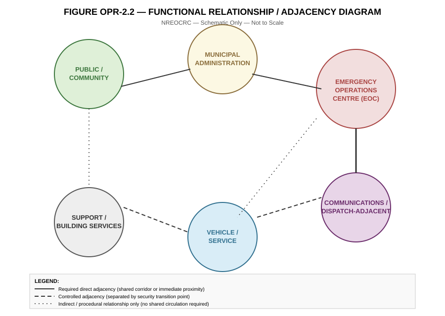

**SYNTHETIC TEST DOCUMENT — NOT ISSUED BY INFRASTRUCTURE ONTARIO**

---

# NORTH RIVER EMERGENCY OPERATIONS AND COMMUNITY RESILIENCE CENTRE
## OWNER'S PROJECT REQUIREMENTS

| Field | Detail |
|---|---|
| Document ID | NREOCRC-OPR-001 |
| Document Title | Owner's Project Requirements — North River Emergency Operations and Community Resilience Centre |
| Revision | 0 |
| Issue Date | December 8, 2026 |
| Issuer | North River Infrastructure Corporation |
| Status | ISSUED WITH RFP — CONTRACTUAL DOCUMENT |
| Forming Part Of | Request for Proposals NREOCRC-RFP-001, Volume 2 |
| Purpose | To establish the Owner's performance and functional requirements for the design and construction of the Project, and to form a Schedule to the Project Agreement upon award |

**SYNTHETIC TEST DOCUMENT — NOT ISSUED BY INFRASTRUCTURE ONTARIO**

---

## SECTION 1 — INTRODUCTION AND PURPOSE

### 1.1 Purpose of this Document

This Owner's Project Requirements ("OPR") sets out the Owner's performance, functional, and technical requirements for the design and construction of the North River Emergency Operations and Community Resilience Centre (the "Project" or "Facility"). This OPR is intended to establish outcomes and performance standards that the Design-Builder is obligated to achieve, while permitting the Design-Builder reasonable latitude in the specific design solutions, materials, systems, and construction methods used to achieve them, except where this OPR expressly prescribes a specific requirement.

### 1.2 Relationship to Other RFP Documents

This OPR is one of several documents comprising the RFP package (NREOCRC-RFP-001 and its Volumes). It is intended to be read together with, and is supplemented by:

- the RFP main document (NREOCRC-RFP-001), which sets out procurement, contractual, and submission requirements;
- the Functional Program, which is incorporated into this OPR as Appendix OPR-1;
- the Indicative Design Package (NREOCRC-IDP-001, to be issued), which illustrates preliminary site and design options and is Indicative unless expressly adopted;
- the Procurement and Milestone Schedule (NREOCRC-SCH-001, to be issued);
- the Data Room Document Register (NREOCRC-DR-001, to be issued), which lists reference and background information.

Where this OPR refers to a document not yet issued at the time of this OPR's issuance, that reference is provided for context and will be given full effect upon issuance of the referenced document.

### 1.3 Scope of this OPR

This OPR addresses requirements for: site planning; architecture; accessibility; the functional program and zoning; structural resilience; mechanical systems; electrical systems; standby power; communications; security; sustainability; durability; operations and maintainability; future expansion; commissioning; and schedule-related design requirements. It does not repeat procurement, evaluation, or contractual terms set out in the RFP main document.

---

## SECTION 2 — DOCUMENT STATUS, AUTHORITY, AND HIERARCHY

### 2.1 Contractual Status

This OPR is a **Contractual Document**. Upon execution of the Project Agreement, this OPR (as may be amended by Addenda issued prior to Proposal Submission, and as may be further amended by any Accepted Proposal Commitment or Accepted Clarification expressly incorporated into the Project Agreement) will form a Schedule to the Project Agreement.

### 2.2 Order of Precedence

Except as otherwise expressly stated in the Project Agreement (once executed), the Owner's current intended order of precedence among RFP-stage documents, from highest to lowest authority, is:

1. The Project Agreement (once executed) and its recitals;
2. Addenda (in reverse chronological order, latest governing);
3. This OPR;
4. The Functional Program (Appendix OPR-1 to this OPR);
5. The RFP main document (NREOCRC-RFP-001), to the extent it contains technical requirements not otherwise addressed in this OPR;
6. Accepted Proposal Commitments (governing over this OPR only to the extent they exceed, and do not derogate from, OPR requirements);
7. The Indicative Design Package (Indicative only, illustrative of design intent, not mandatory except where an element is expressly designated Mandatory therein);
8. Data Room reference material (Reference/Informational only, provided for Design-Builder's own investigation and not warranted by the Owner except as expressly stated).

This order of precedence is the Owner's current statement of intent for RFP purposes and will be restated and finalized in the Project Agreement.

### 2.3 Requirement Classification

Throughout this OPR, individual requirements are classified, where useful, using the following labels. Where a requirement is not labeled, it is a Mandatory requirement unless the surrounding text clearly indicates otherwise.

- **[MANDATORY]** — must be achieved; non-compliance is a Proposal deficiency.
- **[RATED]** — will additionally be considered under RFP rated evaluation criteria for the degree to which it is exceeded (see RFP main document, Section on Evaluation).
- **[INDICATIVE]** — illustrative of Owner intent; Design-Builder may propose an equivalent or alternative approach that meets the underlying performance objective.
- **[REFERENCE]** — background information provided for context; not itself a requirement.
- **[INFORMATIONAL]** — provided to assist the Design-Builder's understanding; carries no contractual obligation.

### 2.4 Precedence Between Text, Tables, and Figures Within This OPR

Where a numeric value or requirement appears in both narrative text and a table or figure within this OPR, the more specific and more recently issued statement governs, subject to Section 2.2. Where an apparent conflict cannot be resolved on this basis, the Design-Builder should raise the matter as a question during the RFP question period so that the Owner may issue a clarifying Addendum.

---

## SECTION 3 — CROSS-REFERENCE INDEX

| Related Document | Document ID | Status at Issuance of this OPR |
|---|---|---|
| Request for Proposals (main document) | NREOCRC-RFP-001 | Issued concurrently |
| Owner's Project Requirements (this document) | NREOCRC-OPR-001 | Issued |
| Functional Program | Appendix OPR-1 (this document) | Issued |
| Indicative Design Package (Options A/B/C) | NREOCRC-IDP-001 | To be issued |
| Procurement and Milestone Schedule | NREOCRC-SCH-001 | To be issued |
| Data Room Document Register | NREOCRC-DR-001 | To be issued |
| City of North River Accessibility Design Standard, 2023 ed. | Ref. TBD in NREOCRC-DR-001 | Incorporated by reference; to be listed |
| Draft Project Agreement | NREOCRC-PA-001 (Draft) | To be issued |

---

## SECTION 4 — SITE PLANNING REQUIREMENTS

**4.1** [MANDATORY] The Facility and associated site works shall be located and configured on the Site described in the RFP main document, in a manner that provides physically separated vehicular access for: (a) public visitors; (b) staff and administrative traffic; (c) emergency support vehicles associated with EOC activation; and (d) service, delivery, and fuel supply vehicles.

**4.2** [MANDATORY] Emergency vehicle access shall provide a minimum unobstructed turning path suitable for a fictional Type C-1 Emergency Support Vehicle (dimensions and turning template to be provided in the Data Room), and shall not require emergency vehicles to cross public parking or public pedestrian circulation at grade except at a marked and controlled crossing point.

**4.3** [MANDATORY] The Site design shall accommodate the Future Expansion Area described in Section 18, in a location that does not require demolition or relocation of primary building structure, standby power infrastructure, or site servicing to accommodate the future expansion.

**4.4** [RATED] Proposals that minimize surface parking area through structured parking, shared parking strategy, or equivalent land-efficient approach, while meeting Section 4 requirements, will be viewed favourably.

**4.5** [MANDATORY] Site design shall address stormwater management in accordance with the requirements of the North River Conservation Authority and applicable municipal standards, recognizing that portions of the Site lie within or adjacent to a mapped regulatory floodplain, as further described in the Data Room.

**4.6** [INDICATIVE] Three preliminary site and building placement concepts are provided in the Indicative Design Package (Options A, B, and C) to illustrate the Owner's thinking regarding achievable site organization. The Design-Builder is not required to adopt any Option and may propose an alternative site strategy that meets the requirements of this Section 4 and the Functional Program.

---

## SECTION 5 — ARCHITECTURAL REQUIREMENTS

**5.1** [MANDATORY] The Facility shall provide a clearly identifiable, dignified, and welcoming public entrance separate from staff, secure, and service entrances, consistent with the security zoning described in Section 8.

**5.2** [MANDATORY] Interior organization shall reflect the zoning principles described in Section 8 and illustrated in Figure OPR-2.1, such that movement between the Public Zone and the Controlled Zone, and between the Controlled Zone and the Secure Zone, occurs only at defined transition points.

**5.3** [INFORMATIONAL] The Owner anticipates that the EOC Operations Room will be the principal architectural and operational focal point of the Facility, with an approximate primary operations floor area in the order of 250 m², exclusive of adjoining section rooms and support space. The governing net area requirement for the EOC Operations Room is set out in the Functional Program (Appendix OPR-1).

**5.4** [MANDATORY] The Facility's public and community training spaces shall be capable of being physically secured and isolated from the remainder of the Facility during EOC activation, including after-hours activation, without requiring staff to pass through public areas to reach secure areas.

**5.5** [RATED] Architectural expression that reflects civic and emergency-management identity appropriate to a public safety facility, while remaining approachable for community use of public spaces, will be considered favourably.

**5.6** [MANDATORY] Exterior envelope design shall address the structural and resilience performance objectives of Section 9, including glazing and opening protection appropriate to the Facility's role as a post-event operational asset.

---

## SECTION 6 — ACCESSIBILITY REQUIREMENTS

**6.1** [MANDATORY] The Facility shall comply with the Ontario Building Code accessibility provisions in effect as of the date of the Project Agreement, and with the City of North River Accessibility Design Standard, 2023 edition, incorporated by reference (see Section 3; full citation to be confirmed in the Data Room Document Register).

**6.2** [MANDATORY] All public-facing spaces, including community training rooms, public washrooms, and the public lobby, shall be fully accessible. Administrative and EOC operational spaces shall provide accessible workstation and circulation provision sufficient to accommodate staff and visiting personnel with disabilities during both routine operations and EOC activation.

**6.3** [RATED] Proposals that exceed minimum code accessibility requirements in EOC operational areas, including accessible design of section rooms and the Secure Entry Vestibule, will be considered favourably.

---

## SECTION 7 — reserved

*(Section number reserved for future Owner use; not applicable at this issuance.)*

---

## SECTION 8 — FUNCTIONAL PROGRAM AND ZONING

### 8.1 General

The Facility is organized into three primary security zones — Public, Controlled, and Secure — as illustrated in **Figure OPR-2.1 (Security Zoning Diagram)**, Appendix OPR-2. Functional relationships and required or permitted adjacencies between functional groups are illustrated in **Figure OPR-2.2 (Functional Relationship / Adjacency Diagram)**, Appendix OPR-2.

**8.2** [MANDATORY] The full Functional Program, including room-by-room net areas, quantities, departmental area subtotals, adjacency requirements, security level assignments, and special requirements, is set out in **Appendix OPR-1** to this OPR and forms a Contractual Document under Section 2.2.

**8.3** [MANDATORY] Security level assignments in Appendix OPR-1 shall govern the access control, construction, and separation requirements applicable to each space, in accordance with Section 14 (Security).

**8.4** [INFORMATIONAL] Additional layered access provisions applicable to the Restricted Communications Sub-Zone identified within the Secure Zone are described in Section 13 (Communications) and Section 14 (Security).

**8.5** [MANDATORY] Net areas set out in Appendix OPR-1 are minimum net areas unless expressly identified as maximum or nominal. Departmental area subtotals in Appendix OPR-1 include an allowance for internal circulation within the departmental grouping; overall building gross-to-net efficiency is addressed in the RFP main document.

---

## SECTION 9 — STRUCTURAL RESILIENCE REQUIREMENTS

**9.1** [MANDATORY] The Facility's structural system shall be designed to remain operational and safely occupiable following the design-basis wind and seismic events applicable to the Site under the Ontario Building Code, with additional importance-category treatment appropriate to a post-disaster facility as defined under the Code's post-disaster building classification.

**9.2** [MANDATORY] The EOC Operations Room, Secure Zone, and standby power infrastructure identified in Section 12 shall be structurally designed such that damage to non-post-disaster-classified portions of the Facility (e.g., public and community spaces) does not compromise continued operation of these spaces.

**9.3** [RATED] Proposals demonstrating structural design margin beyond minimum Code post-disaster requirements, particularly with respect to envelope and roof system performance under design-basis wind events, will be considered favourably.

**9.4** [MANDATORY] Foundation and structural design shall account for Site geotechnical conditions to be described in the Data Room, including any conditions associated with the Site's proximity to the mapped floodplain referenced in Section 4.5.

---

## SECTION 10 — MECHANICAL SYSTEMS REQUIREMENTS

**10.1** [MANDATORY] HVAC systems serving the Secure Zone and EOC Operations Room shall be provided with a minimum of N+1 redundancy for primary cooling and air handling equipment serving these spaces, such that failure of a single piece of primary equipment does not interrupt conditioning of these spaces.

**10.2** [MANDATORY] The Facility shall provide independent zone control such that the Secure Zone and EOC Operations Room can be conditioned and pressurized independently of the remainder of the Facility during activation, including when public and administrative zones are unoccupied or shut down to conserve standby power capacity.

**10.3** [MANDATORY] Domestic water and sanitary systems shall provide sufficient capacity to support continuous 24-hour EOC activation staffing levels set out in the Functional Program for a minimum sustained activation period consistent with Section 12 (Standby Power).

**10.4** [RATED] Mechanical systems design that minimizes maintenance complexity and supports the Owner's self-performed maintenance model (see Section 17) will be considered favourably.

---

## SECTION 11 — ELECTRICAL SYSTEMS REQUIREMENTS

**11.1** [MANDATORY] Electrical distribution serving the Secure Zone, EOC Operations Room, and Communications spaces shall be provided from a dedicated, standby-power-backed distribution system, physically and electrically distinct from distribution serving Public Zone and general administrative loads, such that the latter may be shed without affecting the former.

**11.2** [MANDATORY] The Facility shall provide an uninterruptible power supply (UPS) sized to bridge the transition period between loss of utility power and full assumption of load by the standby generation system described in Section 12, for all Secure Zone, EOC Operations Room, and Communications loads.

**11.3** [MANDATORY] Lighting in the EOC Operations Room and section rooms shall be designed to minimize glare on display and monitoring surfaces and shall provide dimming control appropriate to extended-duration activation use.

---

## SECTION 12 — STANDBY POWER REQUIREMENTS

**12.1** [MANDATORY] The Facility shall be provided with standby power generation capacity sufficient to support full EOC-activated load — comprising the Secure Zone, EOC Operations Room, Communications spaces, and life-safety systems for the balance of the Facility — for a continuous period of no less than **96 hours** without refuelling, at design-basis ambient conditions.

**12.2** Standby Power Sizing Reference (for Design-Builder planning purposes):

| Parameter | Value | Notes |
|---|---|---|
| Estimated EOC-activated critical load | 850–1,050 kW (Class D estimate) | To be confirmed through Design-Builder's own load calculation |
| Generator configuration | N+1 minimum, paralleled | Final configuration is Design-Builder's design responsibility |
| Fuel storage sizing basis | Sized to City of North River Fuel Storage Bylaw minimum of 72 hours continuous operation, with contracted bulk refuelling capability to be arranged within 24 hours of activation | Refer also to Section 12.1 |
| Fuel type | Diesel (assumed) | To be confirmed by Design-Builder in coordination with Owner's Fleet and Fuel Services |

**12.3** [MANDATORY] The standby power system, including fuel storage, shall be located and protected such that it is not rendered inoperable by the same event conditions the Facility is designed to remain operational through, including flood conditions associated with the Site context described in Section 4.5.

**12.4** [RATED] Proposals providing standby power duration, redundancy, or fuel resupply arrangements exceeding the requirements of Sections 12.1 through 12.3 will be considered favourably.

---

## SECTION 13 — COMMUNICATIONS REQUIREMENTS

**13.1** [MANDATORY] The Facility shall provide dedicated space for municipal radio and dispatch-adjacent communications equipment, physically located within the Secure Zone in the area identified in Figure OPR-2.1 as the Restricted Communications Sub-Zone.

**13.2** [MANDATORY] The Restricted Communications Sub-Zone shall be subject to all Secure Zone requirements set out in Section 14, together with additional layered access control such that entry is limited to designated Communications personnel and accompanied, logged visitors only.

**13.3** [MANDATORY] Provision shall be made for future radio tower or rooftop antenna infrastructure; final tower/antenna scope, height, and structural provision will be addressed in the Indicative Design Package and confirmed through the RFP process.

**13.4** [MANDATORY] Server and network equipment supporting EOC and Communications functions shall be provided with dedicated, independently cooled and standby-powered space, separate from general Facility IT closets serving administrative functions.

---

## SECTION 14 — SECURITY REQUIREMENTS

**14.1** [MANDATORY] Access control shall be provided at all transition points between security zones identified in Figure OPR-2.1, using a card-access system for Controlled Zone transitions (Point A) and card access with secondary verification for Secure Zone transitions (Point B).

**14.2** [MANDATORY] The Secure Entry Vestibule shall be sized to accommodate simultaneous surge staffing arrivals during EOC activation, together with associated screening and sign-in functions.

**14.3** [MANDATORY] CCTV coverage shall be provided at all exterior entrances, all zone transition points, the Vehicle/Service Zone, and the perimeter of the Facility, recorded and retained in accordance with a retention period to be confirmed at the RFP stage.

**14.4** [RATED] Proposals demonstrating security design integration (e.g., natural surveillance, CPTED principles, minimized blind corners in the Secure Zone) beyond minimum requirements will be considered favourably.

---

## SECTION 15 — SUSTAINABILITY REQUIREMENTS

**15.1** [MANDATORY] The Facility shall be designed to achieve, at minimum, a recognized third-party sustainable building certification standard at a level to be confirmed in the RFP main document, with due regard to the Facility's resilience and standby power requirements, which may create tension with certain energy-efficiency optimization strategies; where such tension exists, resilience and continuity-of-operation requirements under Sections 9 through 14 govern.

**15.2** [RATED] Proposals demonstrating sustainability performance beyond the minimum certification level, without compromising resilience requirements, will be considered favourably.

---

## SECTION 16 — DURABILITY REQUIREMENTS

**16.1** [MANDATORY] Building envelope, roofing, and primary finishes in public and administrative areas shall be designed for a minimum service life of 40 years with routine maintenance; mechanical and electrical equipment shall be selected for a minimum service life consistent with industry-standard equipment life expectancy tables, to be confirmed with the Owner's maintenance standards at the Data Room stage.

**16.2** [MANDATORY] Materials and finishes in the Vehicle/Service Zone shall be selected for durability appropriate to fleet vehicle operations, including resistance to de-icing chemicals, fuel exposure, and vehicle impact in designated areas.

---

## SECTION 17 — OPERATIONS AND MAINTAINABILITY REQUIREMENTS

**17.1** [INFORMATIONAL] The City will self-perform Facility operations and maintenance following Substantial Completion; the Design-Builder is not responsible for long-term operations or maintenance under this delivery model, as noted in the RFP main document.

**17.2** [MANDATORY] The Design-Builder shall provide equipment selections, access provisions, and system documentation (through the Commissioning process described in Section 19) sufficient to allow the City's own maintenance staff to operate and maintain all Facility systems without ongoing dependency on proprietary or sole-source servicing arrangements, except where a proprietary system is expressly accepted by the Owner.

**17.3** [MANDATORY] Mechanical and electrical rooms shall provide adequate clearance and access for routine maintenance and eventual equipment replacement without requiring demolition of adjacent structure or finishes.

---

## SECTION 18 — FUTURE EXPANSION REQUIREMENTS

**18.1** [MANDATORY] The Facility design shall protect a Future Expansion Area, generally located as illustrated in the Indicative Design Package (to be issued), sufficient to accommodate a future EOC surge-capacity addition of approximately 1,500–2,000 m², without requiring relocation of primary building structure, standby power infrastructure, or the Secure Zone established under this OPR.

**18.2** [MANDATORY] Site servicing, standby power capacity provision (conduit/duct bank stub-outs only; not generation capacity itself), and structural provision (e.g., foundation edge conditions suitable for future connection) shall be coordinated to facilitate future expansion without requiring demolition of completed Project scope.

**18.3** [INDICATIVE] The Future Expansion Area is not part of the current contracted scope of work and will not be constructed under the Project Agreement resulting from this procurement.

---

## SECTION 19 — COMMISSIONING REQUIREMENTS

**19.1** [MANDATORY] The Design-Builder shall develop and execute a Commissioning Plan addressing all Facility systems, with particular emphasis on standby power transfer, HVAC redundancy, security access control, and communications systems described in Sections 10 through 14.

**19.2** [MANDATORY] Commissioning shall include a full-load, full-duration test of the standby power system demonstrating the performance required under Section 12.1, witnessed by the Owner or the Owner's designated Commissioning Authority.

**19.3** [MANDATORY] Record documentation, including as-built drawings, operations and maintenance manuals, and warranty information, shall be provided in a format compatible with the City's facility records requirements, to be confirmed at the RFP stage.

---

## SECTION 20 — SCHEDULE REQUIREMENTS AFFECTING DESIGN

**20.1** [INFORMATIONAL] Design milestones, permit timing, and construction sequencing expectations affecting the requirements in this OPR will be set out in the Procurement and Milestone Schedule (NREOCRC-SCH-001), to be issued as part of the RFP package.

**20.2** [MANDATORY] Where a requirement in this OPR is stated to be confirmed at a later stage (e.g., Sections 6.1, 12.4, 14.3, 15.1, 19.3), such confirmation will be issued by Addendum prior to the Proposal Submission Deadline, and the Design-Builder's Proposal shall be prepared on the basis of the OPR as amended by all Addenda issued prior to that deadline.

---

## APPENDIX OPR-1 — FUNCTIONAL PROGRAM

*Forms a Contractual Document under Section 2.2. Net areas are minimum net areas unless otherwise noted (see Section 8.5).*

| # | Functional Group | Room / Space | Qty | Net Area (m²) each | Dept. Area Subtotal (m²) | Major Adjacency | Security Level | Special Requirement | Notes |
|---|---|---|---|---|---|---|---|---|---|
| 1 | Public / Community | Public Lobby & Reception | 1 | 120 | — | Public entry; Admin reception | Public | Accessible; visual connection to reception | |
| 2 | Public / Community | Community Training Room (large) | 1 | 180 | — | Public Lobby; operable partition to Rm 3 | Public | Operable partition; A/V equipped | Securable independently of rest of Facility |
| 3 | Public / Community | Community Training Room (small) | 1 | 90 | — | Rm 2 (partition) | Public | A/V equipped | |
| 4 | Public / Community | Public Washrooms | 2 | 45 | 570 | Lobby | Public | Fully accessible | Dept. subtotal includes circulation allowance |
| 5 | Public / Community | Public Waiting / Vending Alcove | 1 | 25 | | Lobby | Public | | |
| 6 | Public / Community | Public Zone Circulation Allowance | 1 | 110 | | — | Public | | Included in Dept. subtotal |
| 7 | Municipal Administration | Emergency Management Office — Director | 1 | 24 | — | EM Admin open office; EOC (controlled adjacency) | Controlled | | |
| 8 | Municipal Administration | Emergency Management Office — Open Admin | 1 | 160 | — | Director office; Reception | Controlled | Workstation count per Data Room | |
| 9 | Municipal Administration | Records / Files Room | 1 | 40 | — | Admin open office | Controlled | | |
| 10 | Municipal Administration | Meeting Room (Admin) | 2 | 30 | 850 | Admin open office | Controlled | A/V equipped | Dept. subtotal includes circulation allowance |
| 11 | Municipal Administration | Staff Break Room (Admin) | 1 | 55 | | Admin open office | Controlled | Kitchenette | |
| 12 | Municipal Administration | Print / Supply Room | 1 | 20 | | Admin open office | Controlled | | |
| 13 | Municipal Administration | Admin Zone Circulation Allowance | 1 | 175 | | — | Controlled | | Included in Dept. subtotal |
| 14 | Emergency Operations Centre | EOC Operations Room | 1 | 280 | — | Section Rooms; Secure Entry Vestibule | Secure | Raised floor or accessible underfloor pathway for cabling; acoustically isolated | See Section 5.3 regarding approximate area referenced in prose |
| 15 | Emergency Operations Centre | EOC Section Room — Operations | 1 | 45 | — | EOC Operations Room | Secure | Glazed connection to Ops Room permitted | |
| 16 | Emergency Operations Centre | EOC Section Room — Planning | 1 | 40 | — | EOC Operations Room | Secure | | |
| 17 | Emergency Operations Centre | EOC Section Room — Logistics | 1 | 40 | 1,120 | EOC Operations Room | Secure | | Dept. subtotal includes circulation allowance |
| 18 | Emergency Operations Centre | EOC Section Room — Finance/Admin | 1 | 35 | | EOC Operations Room | Secure | | |
| 19 | Emergency Operations Centre | EOC Director's Office | 1 | 22 | | EOC Operations Room | Secure | | |
| 20 | Emergency Operations Centre | Situational Awareness / Media Briefing Room | 1 | 65 | | EOC Operations Room; Controlled Zone (for media access) | Secure/Controlled interface | Access control at both boundaries | Room bridges Secure and Controlled Zones — see Section 14 |
| 21 | Emergency Operations Centre | Quiet / Rest Room (activation staff) | 2 | 12 | | EOC Operations Room | Secure | | |
| 22 | Emergency Operations Centre | Secure Entry Vestibule | 1 | 35 | | Controlled Zone transition (Point B) | Secure | Screening/sign-in function | Sizing per Section 14.2 |
| 23 | Emergency Operations Centre | EOC Zone Circulation Allowance | 1 | 145 | | — | Secure | | Included in Dept. subtotal |
| 24 | Communications | Radio / Dispatch-Adjacent Room | 1 | 55 | — | Restricted Communications Sub-Zone | Secure (Restricted) | Layered access per Section 13.2 | |
| 25 | Communications | Server / Network Equipment Room (EOC/Comms) | 1 | 45 | 175 | Radio Room | Secure (Restricted) | Independent cooling and standby power | Dept. subtotal includes circulation allowance |
| 26 | Communications | UPS Room | 1 | 30 | | Server Room | Secure (Restricted) | | |
| 27 | Communications | Comms Zone Circulation Allowance | 1 | 45 | | — | Secure (Restricted) | | Included in Dept. subtotal |
| 28 | Standby Power & Building Services | Generator Room | 1 | 140 | — | Fuel Storage; Main Electrical Room | Controlled | N+1 configuration per Section 12 | |
| 29 | Standby Power & Building Services | Fuel Storage | 1 | 60 | — | Generator Room; exterior fuel truck access | Controlled | Flood-protected per Section 12.3 | |
| 30 | Standby Power & Building Services | Main Electrical Room | 1 | 90 | 545 | Generator Room | Controlled | Dedicated Secure/Comms distribution per Section 11.1 | Dept. subtotal includes circulation allowance |
| 31 | Standby Power & Building Services | Main Mechanical Room | 1 | 160 | | — | Controlled | N+1 HVAC equipment per Section 10.1 | |
| 32 | Standby Power & Building Services | Elevator Machine Room (if required) | 1 | 15 | | Elevator shaft | Controlled | Per equipment selection | |
| 33 | Standby Power & Building Services | Bldg Services Circulation Allowance | 1 | 80 | | — | Controlled | | Included in Dept. subtotal |
| 34 | Vehicle / Service | Fleet Bay (EOC support vehicles) | 1 | 260 | — | Site Vehicle/Service Zone access | Controlled | Min. 2 bays; overhead door | |
| 35 | Vehicle / Service | Wash Bay | 1 | 35 | 460 | Fleet Bay | Controlled | Oil/water separator | Dept. subtotal includes circulation allowance |
| 36 | Vehicle / Service | Equipment Storage | 1 | 70 | | Fleet Bay | Controlled | | |
| 37 | Vehicle / Service | Loading / Receiving Area | 1 | 45 | | Site service access | Controlled | | |
| 38 | Support | Janitorial / Housekeeping | 2 | 10 | — | Distributed | Controlled | | |
| 39 | Support | General Storage | 1 | 60 | 260 | — | Controlled | | Dept. subtotal includes circulation allowance |
| 40 | Support | Staff Lockers / Showers | 1 | 55 | | Fleet Bay; Admin | Controlled | | |
| 41 | Support | Staff Lunchroom (Fleet/Service staff) | 1 | 45 | | Fleet Bay | Controlled | | |
| 42 | Support | Loading Dock Office | 1 | 15 | | Loading Area | Controlled | | |

**Program Net Area Subtotal (approximate, sum of Dept. Area Subtotals above): 4,105 m²**

**Notes on the Functional Program:**

(a) Department Area Subtotals include an internal circulation allowance as noted; overall building net-to-gross conversion (targeting the 9,500–11,000 m² gross floor area range identified in the RFP main document) is a Design-Builder design responsibility, subject to Owner review through the RFP process.

(b) The security level assigned to Row 20 (Situational Awareness / Media Briefing Room) reflects its function as a boundary space between the Secure and Controlled Zones; Design-Builders should refer to Section 14 for applicable access control requirements at both boundaries of this room.

(c) Quantities and areas in this Appendix are Mandatory minimums under Section 2.3 unless a row is expressly noted otherwise.

---

## APPENDIX OPR-2 — FIGURES

**Figure OPR-2.1 — Security Zoning Diagram**

**Figure OPR-2.2 — Functional Relationship / Adjacency Diagram**

*Figures are schematic and indicative of required relationships and separations; they do not establish final room locations, dimensions, or building configuration, except where a specific figure is expressly designated Mandatory in the body of this OPR.*

---

## APPENDIX OPR-3 — REFERENCE STANDARDS INDEX (PARTIAL)

*This index will be completed and cross-referenced against the Data Room Document Register (NREOCRC-DR-001) upon its issuance. The following are identified at this stage:*

| Reference | Citation Status |
|---|---|
| Ontario Building Code (current edition at Project Agreement execution) | Standard reference; edition to be fixed at Project Agreement |
| City of North River Accessibility Design Standard, 2023 ed. | Full citation and availability to be confirmed in NREOCRC-DR-001 |
| North River Conservation Authority regulatory mapping and policies | To be provided in Data Room |
| City of North River Fuel Storage Bylaw (current) | Full citation to be confirmed in NREOCRC-DR-001 |
| Sustainable building certification standard (specific standard and target level) | To be confirmed in RFP main document, Section on Sustainability Requirements |

---

**END OF DOCUMENT — NREOCRC-OPR-001, Rev. 0**

**SYNTHETIC TEST DOCUMENT — NOT ISSUED BY INFRASTRUCTURE ONTARIO**
